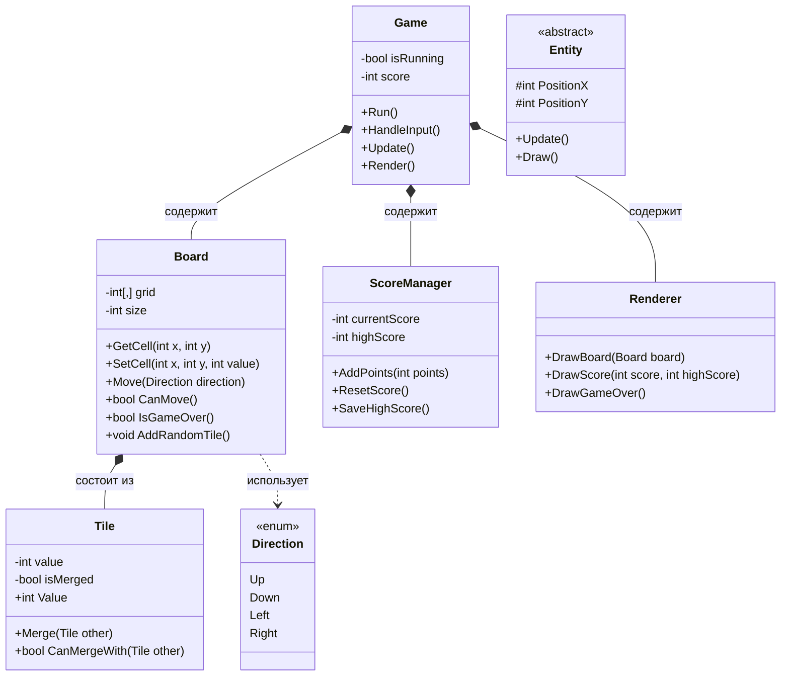

```mermaid
classDiagram
    class Game {
        -bool isRunning
        -int score
        +Run()
        +HandleInput()
        +Update()
        +Render()
    }
    
    class Board {
        -int[,] grid
        -int size
        +GetCell(int x, int y)
        +SetCell(int x, int y, int value)
        +Move(Direction direction)
        +bool CanMove()
        +bool IsGameOver()
        +void AddRandomTile()
    }
    
    class Entity {
        <<abstract>>
        #int PositionX
        #int PositionY
        +Update()
        +Draw()
    }
    
    class Tile {
        -int value
        -bool isMerged
        +Merge(Tile other)
        +bool CanMergeWith(Tile other)
        +int Value
    }
    
    class Direction {
        <<enum>>
        Up
        Down
        Left
        Right
    }
    
    class ScoreManager {
        -int currentScore
        -int highScore
        +AddPoints(int points)
        +ResetScore()
        +SaveHighScore()
    }
    
    class Renderer {
        +DrawBoard(Board board)
        +DrawScore(int score, int highScore)
        +DrawGameOver()
    }
    
    Game *-- Board : содержит
    Game *-- ScoreManager : содержит
    Game *-- Renderer : содержит
    Board *-- Tile : состоит из
    Board ..> Direction : использует
```