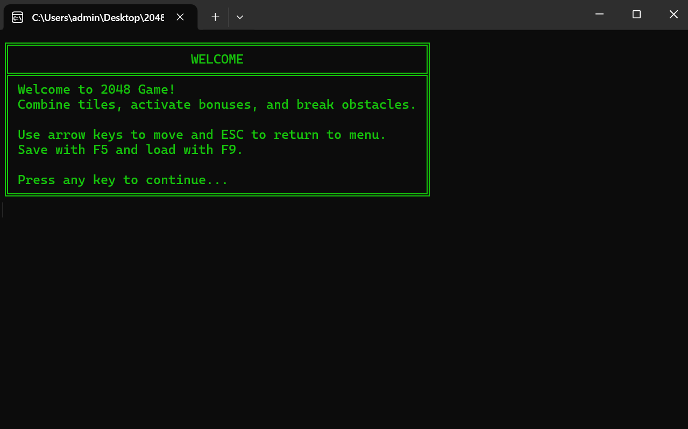
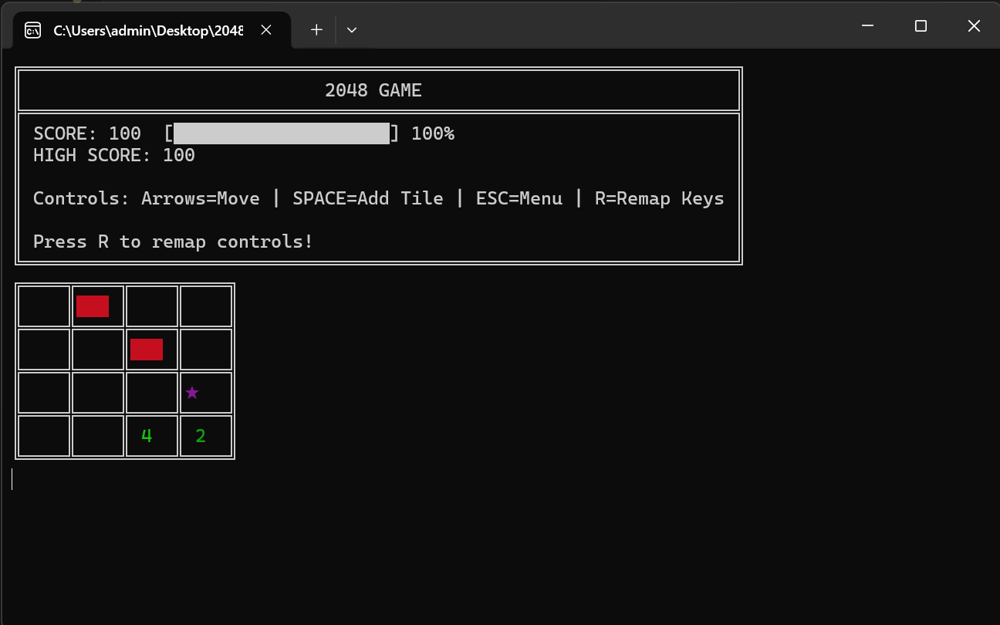
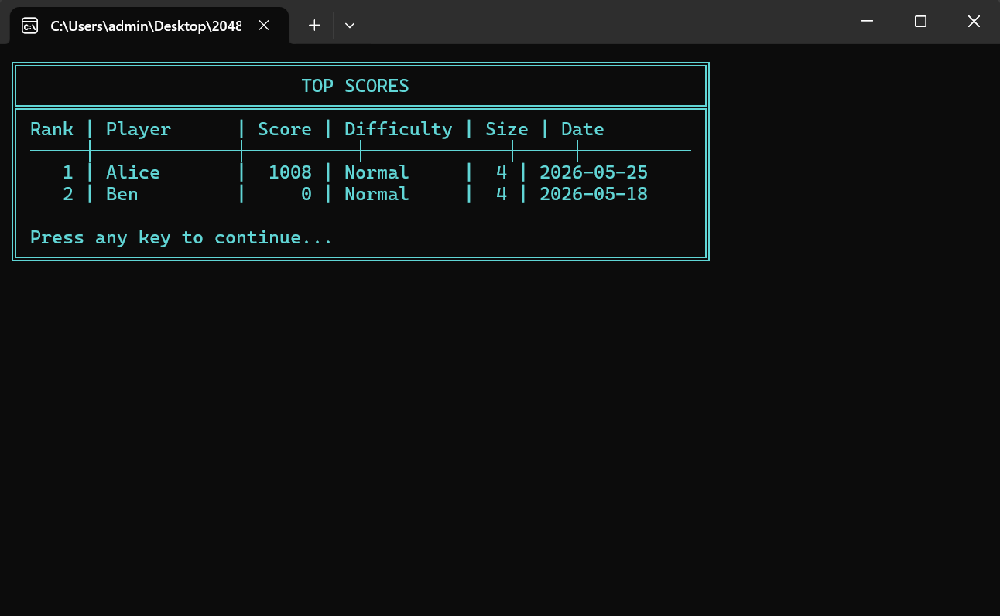

# 2048 Game

[](https://docs.microsoft.com/en-us/dotnet/csharp/)
[](https://dotnet.microsoft.com/)
[](https://opensource.org/licenses/MIT)
[](https://github.com)

```
 ██████╗  ██████╗ ██╗  ██╗ █████╗      ██████╗  █████╗ ███╗   ███╗███████╗
╚════██╗██╔═████╗██║  ██║██╔══██╗    ██╔════╝ ██╔══██╗████╗ ████║██╔════╝
 █████╔╝██║██╔██║███████║╚█████╔╝    ██║  ███╗███████║██╔████╔██║█████╗  
██╔═══╝ ████╔╝██║╚════██║██╔══██╗    ██║   ██║██╔══██║██║╚██╔╝██║██╔══╝  
███████╗╚██████╔╝     ██║╚█████╔╝    ╚██████╔╝██║  ██║██║ ╚═╝ ██║███████╗
╚══════╝ ╚═════╝      ╚═╝ ╚════╝      ╚═════╝ ╚═╝  ╚═╝╚═╝     ╚═╝╚══════╝
```

Консольная реализация популярной игры 2048 с расширенной механикой, специальными типами плиток и чистой архитектурой, демонстрирующей различные паттерны проектирования.

## Скриншоты

### Стартовый экран


### Игровой процесс


### Таблица рекордов


## Особенности

- Классическая механика 2048 с плавным движением и слиянием плиток
- Специальные типы плиток: бонусные (+100 очков) и препятствия (блокируют движение)
- Несколько уровней сложности (Лёгкий, Нормальный, Сложный)
- Настраиваемый размер поля (от 3x3 до 8x8)
- Сохранение и загрузка игры
- Переназначение клавиш управления
- Таблица рекордов

## Как запустить

### Windows
1. Скачайте `2048Game-Windows.zip` из раздела Releases
2. Распакуйте в любую папку
3. Запустите `2048Game.exe`

### Linux
1. Скачайте `2048Game-Linux.tar.gz` из раздела Releases
2. Распакуйте: `tar -xzvf 2048Game-Linux.tar.gz`
3. Запустите: `./2048Game`

### Из исходников
```bash
git clone https://github.com/yourusername/2048Game.git
cd 2048Game
```

## Управление

| Клавиша | Действие |
|---------|----------|
| Стрелки | Движение плиток |
| Пробел | Добавить случайную плитку |
| F5 | Сохранить игру |
| F9 | Загрузить игру |
| R | Переназначить клавиши |
| ESC | Пауза / Меню |

## Игровая механика

### Типы плиток
- **Числовая плитка**: Стандартная плитка, удваивается при слиянии
- **Бонусная плитка (★)**: Даёт +100 очков при слиянии, затем исчезает
- **Препятствие (█)**: Блокирует движение, нельзя переместить

### Подсчёт очков
- Слияние двух плиток даёт очки, равные их сумме
- Множители сложности: Лёгкий (x1), Нормальный (x2), Сложный (x3)
- Бонусы за комбо-слияния

## Архитектура и паттерны проектирования

| Паттерн | Назначение | Реализация |
|---------|-----------|-----------|
| Одиночка | Единственный экземпляр менеджера | GameManager |
| Фабричный метод | Создание разных типов плиток | TileFactory, NumberTileFactory, BonusTileFactory, ObstacleTileFactory |
| Прототип | Клонирование плиток | Tile.Clone() с глубоким копированием |
| Декоратор | Динамический расчёт очков | IScoreCalculator с бонусами сложности |
| Адаптер | Интеграция внешних генераторов | SpecialTileAdapter, BonusAdapter |
| Стратегия | Смена поведения движения | IMovementStrategy с 4 стратегиями |
| Состояние | Управление потоком игры | MenuState, GameState, PauseState, GameOverState |
| Команда | Переназначение клавиш | ICommand с командами движения и действий |
| Наблюдатель | Реактивное обновление интерфейса | События ScoreChanged и HighScoreChanged в ScoreManager |

## Структура проекта

```
2048Game/
├── Core/           # Основная логика и менеджеры
├── States/         # Состояния FSM (Меню, Игра, Пауза, Game Over)
├── Commands/       # Реализация паттерна Команда
├── Entities/       # Типы плиток (Числовые, Бонусные, Препятствия)
├── Systems/        # Поле, менеджер очков, калькуляторы
├── UI/             # Отрисовка консоли и HUD
├── Factories/      # Фабрики плиток
├── Strategies/     # Стратегии движения
├── Adapters/       # Адаптеры для внешних генераторов
└── Events/         # EventArgs для системы событий
```

## Тестирование

```bash
dotnet test 2048Game.Tests
```

Тесты покрывают:
- Логику слияния плиток
- Расчёт очков с модификаторами
- Переходы между состояниями
- Выполнение и переназначение команд
- Сериализацию сохранений

## Требования

- .NET 8.0 SDK (для разработки)
- Windows 10+ или Linux (для запуска исполняемых файлов)

## Лицензия

MIT
